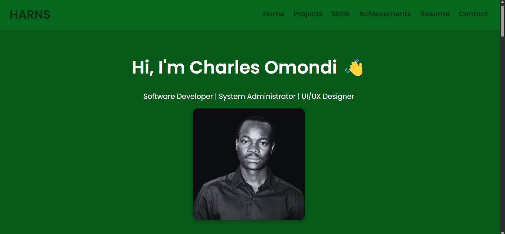

# Charles Omondi – Personal Portfolio Website 🌐

Welcome to my personal developer portfolio! This responsive, single-page site showcases my technical skills, projects, experience, and achievements as a software developer, system administrator, and UI/UX designer.

Hosted on GitHub Pages.

---

## 🔗 Live Demo

👉 [View Portfolio on GitHub Pages](https://your-charles.github.io/portfolio/)

---

## 📸 Screenshot

  
*Optional: Add a screenshot of the homepage and save as `assets/preview.png`.*

---

## 🛠️ Built With

- HTML5  
- CSS3 (Vanilla)  
- Google Fonts (Poppins)  
- Responsive Design (Mobile-Friendly)

---

## ✨ Features

- Highlighted professional projects  
- Technical and soft skills section  
- Achievements & recognitions  
- Downloadable CV  
- Contact details  
- Favicon icon and smooth scrolling  
- Mobile-responsive layout  

---

## 🚀 Getting Started

To run this project locally, follow these simple steps.

### 1. Clone the Repository

```bash
git clone https://github.com/your-username/portfolio.git
cd portfolio
```

### 2. Open in Browser

You can open the `index.html` file directly in your browser:

- **macOS:**  
    ```bash
    open index.html
    ```
- **Windows:**  
    ```bash
    start index.html
    ```
- **Linux:**  
    ```bash
    xdg-open index.html
    ```

Or use a live server (recommended):

- If using VS Code:
    ```bash
    code .
    ```
    Then click **"Go Live"** from the Live Server extension.

---

## 🌍 Hosting on GitHub Pages

To host your portfolio on GitHub Pages:

1. Push your project to a public GitHub repository (e.g., `portfolio`)
2. Go to the repository on GitHub
3. Click on **Settings → Pages**
4. Under **Source**, select:
        - **Branch:** `main`
        - **Folder:** `/ (root)`
5. Click **Save**

Your site will be available at:  
`https://your-username.github.io/portfolio`

---

## 📁 Project Structure

```
portfolio/
├── assets/
│   ├── charles-bg.jpg
│   ├── favicon.png
│   └── preview.png (optional)
├── index.html
└── README.md
```

---

## ✍️ Author

**Charles Omondi**  
📧 charlesomondi232@gmail.com  
📍 Kisumu, Kenya  
📞 +254 719501832

---

## 🪪 License

This project is open-source and free to use. You may customize and adapt it for personal or educational purposes.

Consider adding a proper license (MIT, GPL, etc.) if you want to formalize it.

---

## 🙌 Acknowledgements

- [Google Fonts](https://fonts.google.com/)
- [GitHub Pages](https://pages.github.com/)
- [Favicon.io](https://favicon.io/) (for icon generation)
- **You** – for making it awesome 🎉

---

## ✅ What to Do Next

1. Replace `your-username` with your actual GitHub username
2. Add a `preview.png` screenshot (optional but good for sharing)
3. Push the code to GitHub and enable GitHub Pages under repository settings
4. Share your portfolio link on your CV, LinkedIn, or job applications

---

*If you'd like, I can also help generate a professional `favicon.png` from your initials or a logo. Would you like that?*
